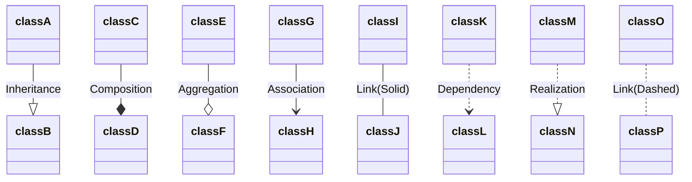
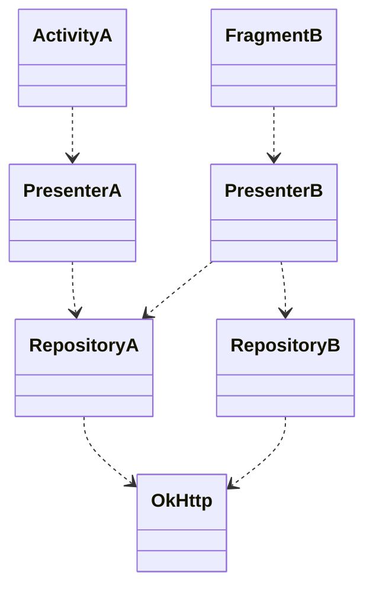
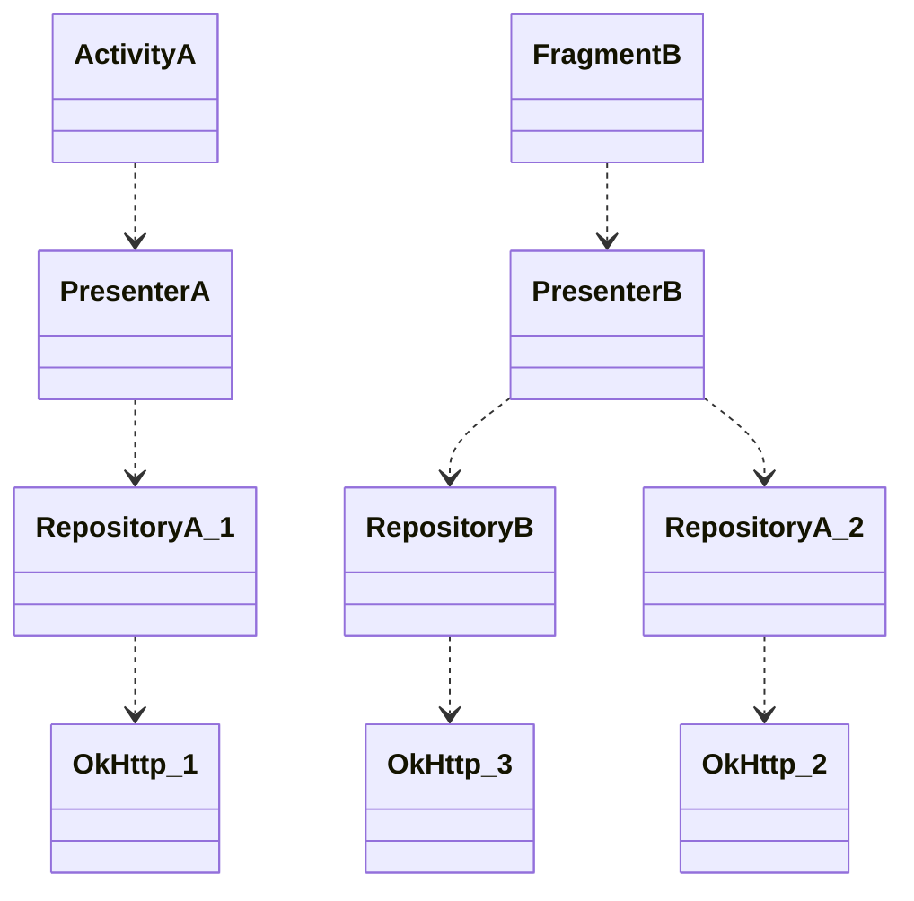
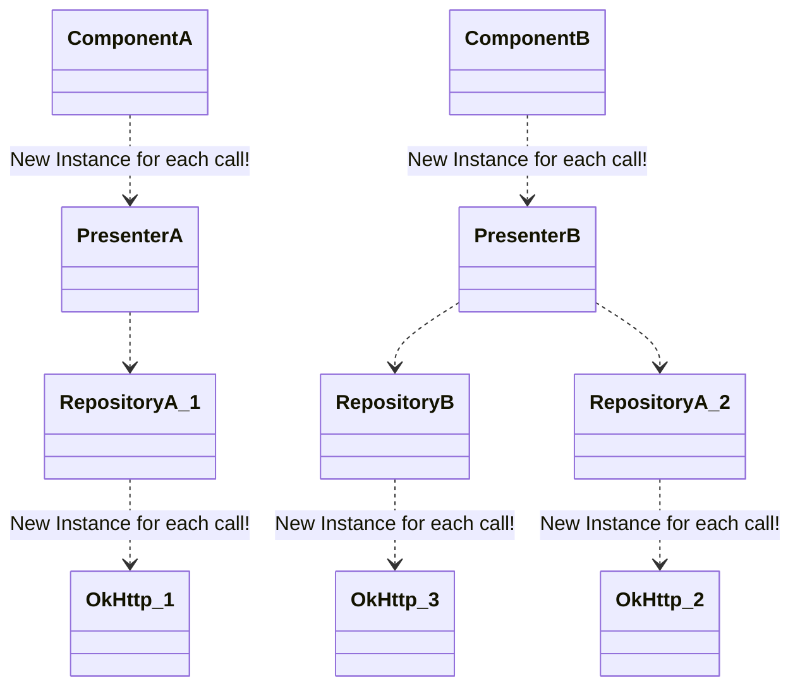
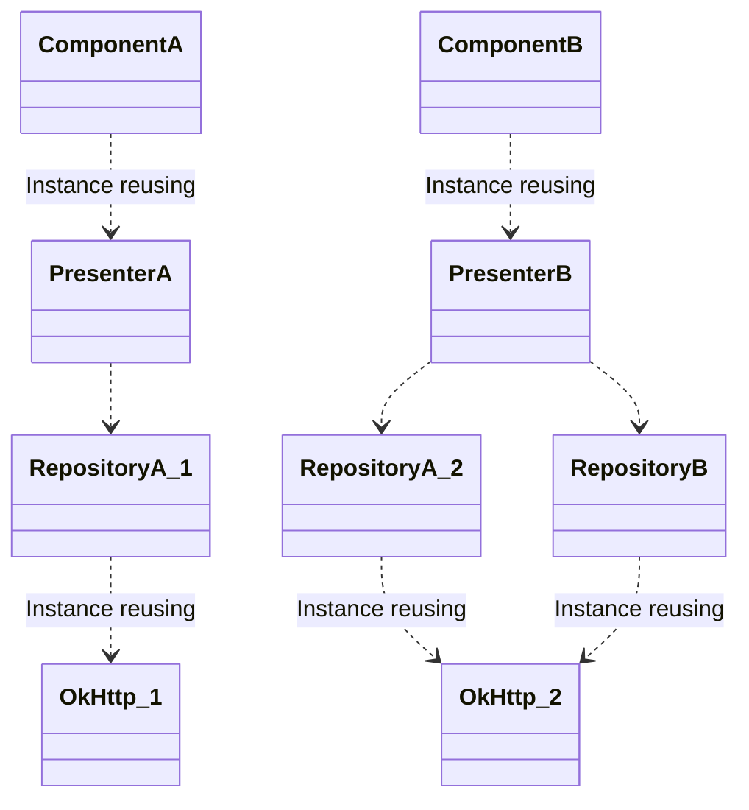

# Emojis

This application was developed to demonstrate the process of Dependency Injection and the usage of Dagger2.

Changes were made gradually, the process of dependency injection can be tracked in according to the order of the branches

1. [hard_di](https://github.com/GSench/Emojis/tree/hard_di) Initially the app was implemented using CleanArchitecture(MVP) approach. Dependencies were injected hard: each object creates its own dependencies
2. [di](https://github.com/GSench/Emojis/tree/di) The first step of DI was Constructor Injection, so now dependencies are provided as parameters.
3. [lifecycle_di](https://github.com/GSench/Emojis/tree/lifecycle_di) The next step is attaching dependencies to Android objects' lifecycle.
4. [manual_di](https://github.com/GSench/Emojis/tree/manual_di) The final step is creating Components hierarchy. Each Component is responsible for providing and storing dependencies for top-level Android objects, like Activity or Fragment. This is the last step of manual DI implementation.
5. [dagger_di](https://github.com/GSench/Emojis/tree/dagger_di) In the last branch I integrated Dagger2 and injected dependencies with this framework.

# Dependency Injection (DI)

- [DI: Google Guide](https://developer.android.com/training/dependency-injection)
- [DI: Yandex Лекция на ШМР](https://www.youtube.com/watch?v=yGiCNunSVN8)

**<u>Dependency injection (DI)</u>** is a technique widely used in programming and well suited to Android development. By following the principles of DI, you lay the groundwork for good app architecture.

Implementing dependency injection provides you with the following advantages:

- Decreasing of code coupling
- Reusability of code
- Ease of refactoring
- Ease of testing

## Problem

Some object has a dependency:

```kotlin
class Car {
	private val engine // need to be initialized
}
```

We need to provide this dependency somehow:

1. The class constructs the dependency it needs. This is **hard dependency**:
```kotlin
class Car {
	private val engine = Engine()
}
```
> (-) Car and Engine are **tightly coupled** - no subclasses or alternative implementations can easily be used. Difficult testing.

2. Grab it from somewhere else.
```kotlin
class Car {
	private val engine = API.getEngine()
}
```

3. Have it supplied as a parameter.
```kotlin
class Car(private val engine: Engine) { }
```
> (+) Reusability of Car. You can pass in different implementations of Engine to Car. Easy testing of Car. You can pass in test doubles to test your different scenarios.

There are two major ways to do DI:

- **Constructor Injection**. You pass the dependencies of a class to its constructor.
- **Field Injection (or Setter Injection)**. Certain framework classes (such as Android Activities and Fragments) are instantiated by the system, so constructor injection is not possible. With field injection, dependencies are instantiated after the class is created.

### Relationships

https://medium.com/@bindubc/association-aggregation-and-composition-in-oops-8d260854a446



| Type    | Description                                                                                                         |
| ------- | ------------------------------------------------------------------------------------------------------------------- |
| `<\|--` | Inheritance - "is a" relationship                                                                                   |
| `*--`   | Composition - child cannot exist independently of the parent, dependent lifecycle "part-of" relationship.           |
| `o--`   | Aggregation - child can exist independently of the parent, own lifecycle, "has-a" relationship.                     |
| `-->`   | Association - objects created and destroyed independently. Composition and Aggregation are subforms of Association. |
| `--`    | Link (Solid)                                                                                                        |
| `..>`   | Dependency                                                                                                          |
| `..\|>` | Realization (Implementation)                                                                                        |
| `..`    | Link (Dashed)                                                                                                       |

## Manual DI

Target dependency graph looks like:



### Step 1: Hard Dependencies

```kotlin
class ActivityA: Activity() {
	private val presenter = PresenterA()
}
class FragmentB: Fragment() {
	private val presenter = PresenterB()
}
class PresenterA {
	private val героA = RepositoryA()
}
class PresenterB {
	private val героA = RepositoryA()
	private val героB = RepositoryB()
}
class RepositoryA {
	private val client = OkHttpClient()
}
class RepositoryB {
	private val client = OkHttpClient()
}
```

Result dependency graph looks like:



- No code reusability
- Objects tightly coupled
- Hard testing

### Step 2: Constructor Injection

```kotlin
class ActivityA(/*constructor must be empty!*/): Activity() {
	private val client = OkHttpClient()
	private val rero = RepositoryA(client)
	private val presenter = PresenterA(rero)
}
class FragmentB(/*constructor must be empty!*/): Fragment() {
	private val client = OkHttpClient()
	private val repoA = RepositoryA(client)
	private val repoB = RepositoryB(client)
	private val presenter = PresenterB(repoA, repoB)
}
class PresenterA(
	private val repoA: RepositoryA
) {}
class PresenterB(
	private val repoA: RepositoryA
	private val repoB: RepositoryB
) {}
class RepositoryA(private val client: OkHttpClient) {}
class RepositoryB(private val client: OkHttpClient) {}
```

Probably not possible, because on Activity or Fragment instantiation we cannot create OkHttpClient or other complex instances, which requires system's services.

### Step 3: Attaching to Application, Activity, Fragment lifecycle

```kotlin
class MyApplication: Application() {
	// This is DI:
	private val client = OkHttpClient()
	private val repoA = RepositoryA(client)
	private val repoB = RepositoryB(client)
	private val presenterA = PresenterA(repoA)
	private val presenterB = PresenterB(repoA, repoB)
}
class ActivityA: Activity() {
	private lateinit var presenterA: PresenterA
	private lateinit var presenterB: PresenterB
	override fun onCreate(...){
		...
		presenterA = (application as MyApplication).presenterA
		presenterB = (application as MyApplication).presenterB
		...
	}
}
class FragmentB: Fragment() {
	private lateinit var presenter: PresenterB
	override fun onCreate(...){
		...
		presenter = (activity as ActivityA).presenterB
		...
	}
}
class PresenterA(
	private val repoA: RepositoryA
) {}
class PresenterB(
	private val repoA: RepositoryA
	private val repoB: RepositoryB
) {}
class RepositoryA(private val client: OkHttpClient) {}
class RepositoryB(private val client: OkHttpClient) {}
```

### Step 4: Components with hierarchy

Components implement ServiceLocator pattern.

```kotlin
class AppComponent {
	private val client by lazy{ OkHttpClient() }
	val componentA by lazy{ ComponentA(client) }
}
class ComponentA(private val client: OkHttpClient) {
	private val repoA by lazy{ RepositoryA(client) }
	val presenterA by lazy{ PresenterA(repoA) }
	val componentB by lazy{ ComponentB(client, repoA) }
}
class ComponentB(
	private val client: OkHttpClient,
	private val repoA: RepositoryA
) {
	private val repoB by lazy{ RepositoryB(client) }
	val presenterB by lazy{ PresenterB(repoA, repoB) }
}

class MyApplication: Application() {
	val component = AppComponent()
}
class ActivityA: Activity() {
	private lateinit var component: ComponentA
	private lateinit var presenter: PresenterA
	override fun onCreate(...){
		...
		component = (application as MyApplication).componentA
		presenter = component.presenterA
		...
	}
}
class FragmentB: Fragment() {
	private lateinit var component: ComponentB
	private lateinit var presenter: PresenterB
	override fun onCreate(...){
		...
		component = (activity as ActivityA).component.componentB
		presenter = component.presenterB
		...
	}
}
class PresenterA(
	private val repoA: RepositoryA
) {}
class PresenterB(
	private val repoA: RepositoryA
	private val repoB: RepositoryB
) {}
class RepositoryA(private val client: OkHttpClient) {}
class RepositoryB(private val client: OkHttpClient) {}
```

### Step 5: Field Injection, Fragment's improvements

```kotlin
class AppComponent {
	private val client by lazy{ OkHttpClient() }
	val componentA by lazy{ ComponentA(client) }
}
class ComponentA(private val client: OkHttpClient) {
	private val repoA by lazy{ RepositoryA(client) }
	private val presenterA by lazy{ PresenterA(repoA) }
	val componentB by lazy{ ComponentB(client, repoA) }
	fun inject(activityA: ActivityA) {
		activityA.presenter = presenterA
		// probably some other properties in proper order
	}
}
class ComponentB(
	private val client: OkHttpClient,
	private val repoA: RepositoryA
) {
	private val repoB by lazy{ RepositoryB(client) }
	private val presenterB by lazy{ PresenterB(repoA, repoB) }
	fun inject(fragmentB: FragmentB) {
		fragmentB.presenter = presenterB
		// probably some other properties in proper order
	}
}

class MyApplication: Application() {
	val component = AppComponent()
}
class ActivityA: Activity() {
	private lateinit var component: ComponentA
	private lateinit var presenter: PresenterA
	override fun onCreate(...){
		...
		component = (application as MyApplication).componentA
		component.inject(this)
		...
	}
	... {
		...
		val fragmentB = FragmentB.newInstance(component.componentB)
		...
	}
}
class FragmentB: Fragment() {
	private lateinit var component: ComponentB
	private lateinit var presenter: PresenterB
	companion object {
		...
		fun newInstance(..., componentB: ComponentB): FragmentB {
			val fragmentB = FragmentB()
			...
			fragmentB.component = componentB
			...
			return fragmentB
		}
	}
	override fun onCreate(...){
		...
		componentB.inject(this)
		...
	}
}
class PresenterA(
	private val repoA: RepositoryA
) {}
class PresenterB(
	private val repoA: RepositoryA
	private val repoB: RepositoryB
) {}
class RepositoryA(private val client: OkHttpClient) {}
class RepositoryB(private val client: OkHttpClient) {}
```

### Final Step: Dependency Inversion

```kotlin
class AppComponent {
	private val client by lazy{ OkHttpClient() }
	val componentA by lazy{ ComponentA(client) }
}
class ComponentA(private val client: OkHttpClient) {
	private val repoA by lazy{ RepositoryAImpl(client) }
	private var presenterA: PresenterA? = null
	val componentB by lazy{ ComponentB(client, repoA) }
	fun inject(activityA: ActivityA) {
		if(presenterA == null) presenterA = PresenterAImpl(activityA, repoA)
		activityA.presenter = presenterA
		// probably some other properties in proper order
	}
}
class ComponentB(
	private val client: OkHttpClient,
	private val repoA: RepositoryA
) {
	private val repoB by lazy{ RepositoryBImpl(client) }
	private var presenterB: PresenterB? = null
	fun inject(fragmentB: FragmentB) {
		if(presenterB == null) presenterB = PresenterBImpl(fragmentB, repoA, repoB)
		fragmentB.presenter = presenterB
		// probably some other properties in proper order
	}
}

class MyApplication: Application() {
	val component = AppComponent()
}
interface ViewA
class ActivityA: Activity(), ViewA {
	private lateinit var component: ComponentA
	private lateinit var presenter: PresenterB
	override fun onCreate(...){
		...
		component = (application as MyApplication).componentA
		component.inject(this)
		...
	}
	... {
		...
		val fragmentB = FragmentB.newInstance(component.componentB)
		...
	}
}
interface ViewB
class FragmentB: Fragment(), ViewB {
	private lateinit var component: ComponentB
	private lateinit var presenter: PresenterB
	companion object {
		...
		fun newInstance(..., componentB: ComponentB): FragmentB {
			val fragmentB = FragmentB()
			...
			fragmentB.component = componentB
			...
			return fragmentB
		}
	}
	override fun onCreate(...){
		...
		componentB.inject(this)
		...
	}
}

interface PresenterA
class PresenterAImpl (
	private val viewA: ViewA
	private val repoA: RepositoryA
): PresenterA {}

interface PresenterB
class PresenterBImpl (
	private val viewB: ViewB
	private val repoA: RepositoryA
	private val repoB: RepositoryB
): PresenterB {}

interface RepositoryA
class RepositoryAImpl(
	private val client: OkHttpClient
): RepositoryA {}

interface RepositoryB
class RepositoryBImpl(
	private val client: OkHttpClient
): RepositoryB {}
```

In practice repositories depends on DataSources, not HttpClient or DBClient itself. But DataSource's class structure (class, interface) and DI is identical to repositories' structure and DI.
## Dagger 2

- [Dagger2](https://dagger.dev/)
- [Dagger2 Google Guide](https://developer.android.com/training/dependency-injection/dagger-basics)

Dagger is a fully static, compile-time [dependency injection](http://en.wikipedia.org/wiki/Dependency_injection) framework for Java, Kotlin, and Android.

### Dagger Setup

- [Dagger itself](https://github.com/google/dagger/tree/master)
- [Kotlin kapt](https://kotlinlang.org/docs/kapt.html)

build.gradle.kts
```kotlin
// Kotlin Annotation Processing Тооl
plugins {
    kotlin("kapt") version "1.9.23"
}

// Add Dagger dependencies
dependencies {
  implementation("com.google.dagger:dagger:2.x")
  kapt("com.google.dagger:dagger-compiler:2.x")
}
```

### Dagger DI

Lets design DI with Dagger for Exaple above without Dependency Inversion first (for **Step 4**).

https://dagger.dev/tutorial/02-initial-dagger

#### [@Component](https://dagger.dev/api/latest/dagger/Component.html)

Annotates an interface or abstract class for which a fully-formed, dependency-injected implementation is to be generated from a set of modules().

```kotlin
@Component
interface ComponentA {
	fun getPresenterA(): PresenterA
}
@Component
interface ComponentB {
	fun getPresenterB(): PresenterB
}
```

Using Components:

```kotlin
class ActivityA: Activity() {
	private lateinit var component: ComponentA
	private lateinit var presenter: PresenterA
	override fun onCreate(...){
		...
		component = DaggerComponentA.builder().build()
		presenter = component.getPresenterA()
		...
	}
}
class FragmentB: Fragment() {
	private lateinit var component: ComponentB
	private lateinit var presenter: PresenterB
	override fun onCreate(...){
		...
		component = DaggerComponentB.builder().build()
		presenter = component.getPresenterB()
		...
	}
}
```

`DaggerComponentA:ComponentA` and `DaggerComponentB:ComponentB` are generated by Dagger after first build. 

But how Dagger can implement these interfaces? He need to know how to create instances of `PresenterA` and `PresenterB`.
#### [@Inject](https://docs.oracle.com/javaee/7/api/javax/inject/Inject.html) constructor

```kotlin
class PresenterA @Inject constructor (
	private val repoA: RepositoryA
) {}
class PresenterB @Inject constructor (
	private val repoA: RepositoryA
	private val repoB: RepositoryB
) {}
class RepositoryA @Inject constructor (
	private val client: OkHttpClient
) {}
class RepositoryB @Inject constructor (
	private val client: OkHttpClient
) {}
```

**`@Inject`-constructor is called on EACH inject!** 

Dagger still dont know how to create `client: OkHttpClient`.

#### [@Module](https://dagger.dev/api/latest/dagger/Module.html) [@Provides](https://dagger.dev/api/latest/dagger/Provides.html)

`@Module` annotates a class that contributes to the object graph.

`@Provides` annotates methods of a module to create a provider method binding. The method's return type is bound to its returned value.

```kotlin
@Module
object NetworkModule {
	@Provides
	fun okHttpClient(): OkHttpClient {
		...
		return client
	}
}
```

**`@Provides`-method is called on EACH inject!** 

Connecting `@Module`s to `@Component`s:

```kotlin
@Component(modules = [NetworkModule::class])
interface ComponentA {
	fun getPresenterA(): PresenterA
}
@Component(modules = [NetworkModule::class])
interface ComponentB {
	fun getPresenterB(): PresenterB
}
```

#### [@Scope](https://dagger.dev/api/latest/dagger/model/Scope.html)

Current dependency injection looks like:



Even HttpCliens are instaniated each call, despite they are injected in `object`.

`Scope` sets the lifetime of objects to lifetime of the `Component`.

```kotlin
@Scope
annotation class AppScope

@Module
object NetworkModule {
	@Provides
	@AppScope
	fun okHttpClient(): OkHttpClient {
		...
		return client
	}
}

@AppScope
class RepositoryA @Inject constructor (
	private val client: OkHttpClient
) {}
@AppScope
class RepositoryB @Inject constructor (
	private val client: OkHttpClient
) {}

@AppScope
class PresenterA @Inject constructor (
	private val repoA: RepositoryA
) {}
@AppScope
class PresenterB @Inject constructor (
	private val repoA: RepositoryA
	private val repoB: RepositoryB
) {}

@Component(modules = [NetworkModule::class])
@AppScope
interface ComponentA {
	fun getPresenterA(): PresenterA
}
@Component(modules = [NetworkModule::class])
@AppScope
interface ComponentB {
	fun getPresenterB(): PresenterB
}

```

Now all created properties are instantiated once.
(`fun getPresenterA()` <=>`val getPresenterA by lazy{ ... }`)

Multiple `Component`s can have the same `Scope`. 
But! Their properties are created separately.



А single binding may not declare more than one `@Scope`. `@Component`s may have > 1 `@Scope`.

We want to inject `MyManager` in both `@Component`s:

```kotlin
@ComponentAScope
@ComponentBScope // ERROR!
class MyManager @Inject constructor(){...}

@Component
@ComponentAScope
interface ComponentA {...}

@Component
@ComponentBScope
interface ComponentB {...}
```

Solution:

```kotlin
@Scope
annotation class MyManagerScope

@MyManagerScope
class MyManager @Inject constructor()

@Component
@ComponentAScope
@MyManagerScope
interface ComponentA {...}

@Component
@ComponentBScope
@MyManagerScope
interface ComponentB {...}

```

#### [@Inject](https://docs.oracle.com/javaee/7/api/javax/inject/Inject.html) properies

```kotlin
class ActivityA: Activity() {
	lateinit var component: ComponentA
	@Inject lateinit var presenter: PresenterA
	override fun onCreate(...){
		...
		component = DaggerComponentA.builder().build()
		component.inject(this)
		...
	}
}
class FragmentB: Fragment() {
	lateinit var component: ComponentB
	@Inject lateinit var presenter: PresenterB
	override fun onCreate(...){
		...
		component = DaggerComponentB.builder().build()
		component.inject(this)
		...
	}
}
```

#### [@Binds](https://dagger.dev/api/latest/dagger/Binds.html)

Annotates abstract methods of a `Module` that delegate bindings.

https://dagger.dev/tutorial/04-depending-on-interface

Problem: We need to inject a dependency that implements some interface (e.g. for dependency inversion)

```kotlin
interface RepositoryA

class RepositoryAImpl @Inject constructor (
	private val client: OkHttpClient
): RepositoryA {}

class PresenterA @Inject constructor (
	private val repoA: RepositoryA // Dagger unable to inject this
) {}
```

Possible solution:
```kotlin
@Module
object RepositoryModule {
	@Provides
	fun repoA(impl: RepositoryAImpl): RepositoryA {
		// any params in fun are possible
		// here we can do smth with impl
		return impl
	}
}
@Component(modules = [NetworkModule::class, RepositoryModule::class])
interface ComponentA {
	fun getPresenterA(): PresenterA
}
```

We can use `@Binds` in `@Module interface` instead of `@Provides object`

```kotlin
@Module
interface RepositoryModule {
	@Binds
	fun repoA(impl: RepositoryAImpl): RepositoryA
	// only one param in fun is possible
	// impl must derive on fun's return
}
@Component(modules = [NetworkModule::class, RepositoryModule::class])
interface ComponentA {
	fun getPresenterA(): PresenterA
}
```

`@Binds` functions are called once! Dagger reuses cast results.

Interface `@Module`s may contain `@Provides` functions with `companion object`.

```kotlin
@Module
interface RepositoryModule {
	companion object {
		@Provides
		fun repoVersion(settings: Settings): String {
			return ...
		}
	}
	@Binds
	fun repoA(impl: RepositoryAImpl): RepositoryA
	// only one param in fun is possible
	// impl must derive on fun's return
}
```

*Best practice*: using only interface `@Module`s:

```kotlin
@Module
interface NetworkModule {
	companion object {
		@Provides
		fun okHttpClient(): OkHttpClient {
			...
			return client
		}
	}
}
```

#### [@BindsInstance](https://dagger.dev/api/latest/dagger/BindsInstance.html) [@Component.Builder](https://dagger.dev/api/latest/dagger/Component.Builder.html) [@Component.Factory](https://dagger.dev/api/latest/dagger/Component.Factory.html)

`@Component.Builder` A builder is a type with setter methods for the modules, dependencies and bound instances required by the component and a single no-argument build method that creates a new component instance.

`@Component.Factory` A factory is a type with a single method that returns a new component instance each time it is called.

`@BindsInstance` Marks a method on a component builder or a parameter on a component factory as binding an instance to some key within the component.

```kotlin
@Module
interface NetworkModule {
	companion object {
		@Provides
		fun okHttpClient(context: Context): OkHttpClient {
			// we must create OkHttpClient with Android Context
			...
			return client
		}
	}
}
```

So we need to provide `context: Context` parameter outside of components.

Using `@Component.Builder`:

```kotlin
@Component(modules = [NetworkModule::class, RepositoryModule::class])
interface ComponentA {
	@Component.Builder
	interface Builder {
		fun withContext(@BindsInstance context: Context): Builder
		fun build(): ComponentA
	}
	fun getPresenterA(): PresenterA
}

class ActivityA: Activity() {
	lateinit var component: ComponentA
	@Inject lateinit var presenter: PresenterA
	override fun onCreate(...){
		...
		component = DaggerComponentA.builder()
			.withContext(this)
			.build()
		component.inject(this)
		...
	}
}
```

Using `@Component.Factory` - *best practice*, as we wont forget to provide Builder's dependencies (runtime crash othw):

```kotlin
@Component(modules = [NetworkModule::class, RepositoryModule::class])
interface ComponentA {
	@Component.Factory
	interface Factory {
		fun create(
			@BindsInstance context: Context
		): ComponentA
	}
	fun getPresenterA(): PresenterA
}

class ActivityA: Activity() {
	lateinit var component: ComponentA
	@Inject lateinit var presenter: PresenterA
	override fun onCreate(...){
		...
		component = DaggerComponentA.factory().create(
			context = this
		)
		component.inject(this)
		...
	}
}
```

#### `Provider<>` & `Lazy<>

```kotlin
class Foo @Inject constructor(private val heavyObj: Heavy) {
	fun bar(){
		if(...){
			heavyObj.doSmth()
		}
	}
}
```

Properties can be heavy objects. If their creation can be postponed until necessary, we can wrap them with `Provider<>` or `Lazy<>`

```kotlin
class Foo @Inject constructor(private val heavyObj: Provider<Heavy>) {
	fun bar(){
		if(...){
			heavyObj.get().doSmth() // heavyObj initialized only now
		}
	}
}
```

`Provider.get()` creates new instance of `Heavy` object each time!

```kotlin
class Foo @Inject constructor(private val heavyObj: Lazy<Heavy>) {
	fun bar(){
		if(...){
			heavyObj.get().doSmth() // heavyObj initialized only now
		}
	}
}
```

`Lazy.get()` remembers object's instantiation.

#### [@Subcomponent](https://dagger.dev/api/latest/dagger/Subcomponent.html)

A subcomponent that inherits the bindings from a parent Component or Subcomponent.

```kotlin
@Scope
annotation class AppScope
@Component(modules = [NetworkModule::class, RepositoryModule::class])
@AppScope
interface AppComponent {
	fun getComponentA(): ComponentA
}

@Scope
annotation class ComponentAScope
@Subcomponent // Subcomponent may also have modules
@ComponentAScope // Subcomponent may not have parent's Scope
interface ComponentA {
	fun getPresenterA(): PresenterA
	fun getComponentB(): ComponentB
}

@Scope
annotation class ComponentBScope
@Subcomponent
@ComponentBScope
interface ComponentB {
	fun getPresenterB(): PresenterB
}
```

```kotlin
class MyApplication: Application() {
	lateinit var component: AppComponent
		private set
	override fun onCreate(){
		...
		component = DaggerAppComponent().builder().build()
	}
}
class ActivityA: Activity() {
	lateinit var component: ComponentA
	@Inject lateinit var presenter: PresenterA
	override fun onCreate(...){
		...
		component = (application as MyApplication).component.getComponentA()
		component.inject(this)
		...
	}
	... {
		...
		val fragmentB = FragmentB.newInstance(component.getComponentB())
		...
	}
}
class FragmentB: Fragment() {
	lateinit var component: ComponentB
	@Inject lateinit var presenter: PresenterB
	companion object {
		...
		fun newInstance(..., componentB: ComponentB): FragmentB {
			val fragmentB = FragmentB()
			...
			fragmentB.component = componentB
			...
			return fragmentB
		}
	}
	override fun onCreate(...){
		...
		component.inject(this)
		...
	}
}
```

- `@Subcomponent` contains everything that is in the parent.
- `@Subcomponent` lifetime < parent lifetime
-  `@Subcomponent` may not have parent's `@Scope`
-  Multiple children `@Subcomponent`s may have the same `@Scope`

##### [@Subcomponent.Factory](https://dagger.dev/api/latest/dagger/Subcomponent.Factory.html)

```kotlin
@Scope
annotation class AppScope
@Component(modules = [NetworkModule::class, RepositoryModule::class])
@AppScope
interface AppComponent {
	@Component.Factory
	interface Factory {
		fun create(
			@BindsInstance context: Context
		): AppComponent
	}
	fun getComponentA(): ComponentA.Factory
	// We cannot return ComponentA, if it has Factory or Builder
}

@Scope
annotation class ComponentAScope
@Subcomponent
@ComponentAScope
interface ComponentA {
	@Subcomponent.Factory
	interface Factory {
		fun create(): ComponentA
	}
	fun getPresenterA(): PresenterA
	fun getComponentB(): ComponentB.Factory
}

@Scope
annotation class ComponentBScope
@Subcomponent
@ComponentBScope
interface ComponentB {
	@Subcomponent.Factory
	interface Factory {
		fun create(): ComponentB
	}
	fun getPresenterB(): PresenterB
}
```

```kotlin
class MyApplication: Application() {
	lateinit var component: AppComponent
		private set
	override fun onCreate(){
		...
		component = DaggerAppComponent().factory(this).create()
	}
}
class ActivityA: Activity() {
	lateinit var component: ComponentA
	@Inject lateinit var presenter: PresenterA
	override fun onCreate(...){
		...
		component = (application as MyApplication)
			.component
			.getComponentA()
			.factory()
			.create()
		component.inject(this)
		...
	}
	... {
		...
		val fragmentB = FragmentB.newInstance(component
			.getComponentB()
			.factory()
			.create()
		)
		...
	}
}
class FragmentB: Fragment() {
	lateinit var component: ComponentB
	@Inject lateinit var presenter: PresenterB
	companion object {
		...
		fun newInstance(..., componentB: ComponentB): FragmentB {
			val fragmentB = FragmentB()
			...
			fragmentB.component = componentB
			...
			return fragmentB
		}
	}
	override fun onCreate(...){
		...
		component.inject(this)
		...
	}
}
```

#### `@Qualifier`

Allows to mark different `@BindsInstance` args, `@Bind` fun, `@Provides` fun that has the same return type.

We want to choose `@Provides` or `@Bind` implementation:

```kotlin
@Module
object NetworkModule {
	@Provides
	fun okHttpClientNonCaching(): OkHttpClient { ... }
	@Provides
	fun okHttpClientCaching(): OkHttpClient { ... }
}
// ERROR: OkHttpClient is bound multiple times!
```

Creating `@Qualifier`s:

```kotlin
@Qualifier
annotation class CachingClient
@Qualifier
annotation class NonCachingClient
```

Qualification:

```kotlin
@Module
object NetworkModule {
	@Provides
	@NonCachingClient
	fun okHttpClientNonCaching(): OkHttpClient { ... }
	@Provides
	@CachingClient
	fun okHttpClientCaching(): OkHttpClient { ... }
}
class PresenterA @Inject constructor (
	@CachingClient private val client: OkHttpClient
	...
) {}
class FragmentA: Fragment {
	@Inject
	@NonCachingClient
	lateinit var client: OkHttpClient
	@Inject
	@CachingClient
	lateinit var clientCache: OkHttpClient
	...
}
```

`@Qualifier` do not affect object's lifetime!

##### `@Qualifier` primitives

```kotlin
@Qualifier
annotation class Version
@Module
object VersionModule {
	@Provides
	@Version
	fun versionName(): String = BuildConfig.VERSION_NAME
	@Provides
	@Version
	fun versionCode(): Int = BuildConfig.VERSION_CODE
}
class Logger @Inject constructor (
	@Version val versionName: String,
	@Version val versionCode: Int,
) {...}
```

##### `@Qualifier` with arguments

```kotlin
enum class HostMode {
	PROD,
	DEBUG
}
@Qualifier
annotation class Host(val mode: HostMode)
@Module
object HostModule {
	@Provides
	@Host(HostMode.DEBUG)
	fun debug(): String = "debug.host.com"
	@Provides
	@Host(HostMode.PROD)
	fun prod(): String = "host.com"
}
@Module
object NetworkModule {
	@Provides
	fun retrofit(
		@Host(HostMode.DEBUG) debug: String,
		@Host(HostMode.PROD) prod: String
	): Retrofit {
		val host = if(BuildConfig.DEBUG) debug else prod
		return ...
	}
}
```


### Final Dagger DI implementation

Components:

```kotlin
@Scope annotation class AppScope

@Component(modules = [
	HostModule::class,
	NetworkModule::class,
	RepositoryModule::class,
	PresenterModule::class,
])
@AppScope
interface AppComponent {
	@Component.Factory
	interface Factory {
		fun create(@BindsInstance context: Context): AppComponent
	}
	fun getComponentA(): ComponentA.Factory
}

@Scope annotation class ComponentAScope
@Subcomponent @ComponentAScope
interface ComponentA {
	@Subcomponent.Factory
	interface Factory {
		fun create(@BindsInstance view: ViewA): ComponentA
	}
	fun getPresenterA(): PresenterA
	fun getComponentB(): ComponentB.Factory
}

@Scope annotation class ComponentBScope
@Subcomponent @ComponentBScope
interface ComponentB {
	@Subcomponent.Factory
	interface Factory {
		fun create(@BindsInstance view: ViewB): ComponentB
	}
	fun getPresenterB(): PresenterB
}
```

Network:

```kotlin
enum class HostMode {PROD, DEBUG}
@Qualifier annotation class Host(val mode: HostMode)
@Module object HostModule {
	@Provides @Host(HostMode.DEBUG) @AppScope
	fun debug(): String = "debug.host.com"
	@Provides @Host(HostMode.PROD) @AppScope
	fun prod(): String = "host.com"
}

@Qualifier annotation class CachingClient
@Qualifier annotation class NonCachingClient
@Module interface NetworkModule {
	companion object {
		@Provides @CachingClient @AppScope
		fun okHttpClientCache(context: Context): OkHttpClient {
			...
			return client
		}
		@Provides @NonCachingClient @AppScope
		fun okHttpClient(context: Context): OkHttpClient {
			...
			return client
		}
		@Provides @AppScope
		fun retrofit(
			context: Context,
			@Host(HostMode.DEBUG) debug: String,
			@Host(HostMode.PROD) prod: String,
		): Retrofit {
			val host = if(BuildConfig.DEBUG) debug else prod
			...
			return retrofitImpl
		}
		@Provides @CachingClient @AppScope
		fun retrofitWithCache(
			@CachingClient client: OkHttpClient,
			@Host(HostMode.DEBUG) debug: String,
			@Host(HostMode.PROD) prod: String,
		): Retrofit {
			val host = if(BuildConfig.DEBUG) debug else prod
			...
			return retrofitImpl
		}
	}
}
```

Repositories:

```kotlin
interface RepositoryA{...}
class RepositoryAImpl @Inject constructor (
	@NonCachingClient private val client: Lazy<OkHttpClient>
): RepositoryA {...}

interface RepositoryB{...}
class RepositoryBImpl @Inject constructor (
	@CachingClient private val retrofit: Lazy<Retrofit>
): RepositoryB {...}

@Module
interface RepositoryModule {
	@Binds fun repoA(impl: RepositoryAImpl): RepositoryA
	@Binds fun repoB(impl: RepositoryBImpl): RepositoryB
}
```

Presenters:

```kotlin
interface PresenterA {...}
class PresenterAImpl @Inject constructor (
	private val viewA: ViewA,
	private val repoA: RepositoryA,
) {}
interface PresenterB {...}
class PresenterBImpl @Inject constructor (
	private val viewB: ViewB,
	private val repoA: RepositoryA,
	private val repoB: RepositoryB,
) {}

@Module
interface PresenterModule {
	@Binds fun presenterA(impl: PresenterAImpl): PresenterA
	@Binds fun presenterB(impl: PresenterBImpl): PresenterB
}
```

ViewModule:

```kotlin
interface ViewA {...}
interface ViewB {...}
```

Views:

```kotlin
class MyApplication: Application() {
	lateinit var component: AppComponent
		private set
	override fun onCreate(){
		...
		component = DaggerAppComponent().factory(context = this).create()
	}
}

interface ViewA {...}

class ActivityA: Activity(), ViewA {
	lateinit var component: ComponentA
	@Inject lateinit var presenter: PresenterA
	override fun onCreate(...){
		...
		component = (application as MyApplication)
			.component
			.getComponentA()
			.factory()
			.create(view = this)
		component.inject(this)
		...
	}
	... {
		...
		val fragmentB = FragmentB.newInstance(component)
		...
	}
}

interface ViewB {...}

class FragmentB: Fragment(), ViewB {
	lateinit var component: ComponentB
	@Inject lateinit var presenter: PresenterB
	companion object {
		...
		fun newInstance(..., componentA: ComponentA): FragmentB {
			val fragmentB = FragmentB()
			...
			fragmentB.component = componentA
				.getComponentB()
				.factory()
				.create(view = fragmentB)
			...
			return fragmentB
		}
	}
	override fun onCreate(...){
		...
		component.inject(this)
		...
	}
}
```